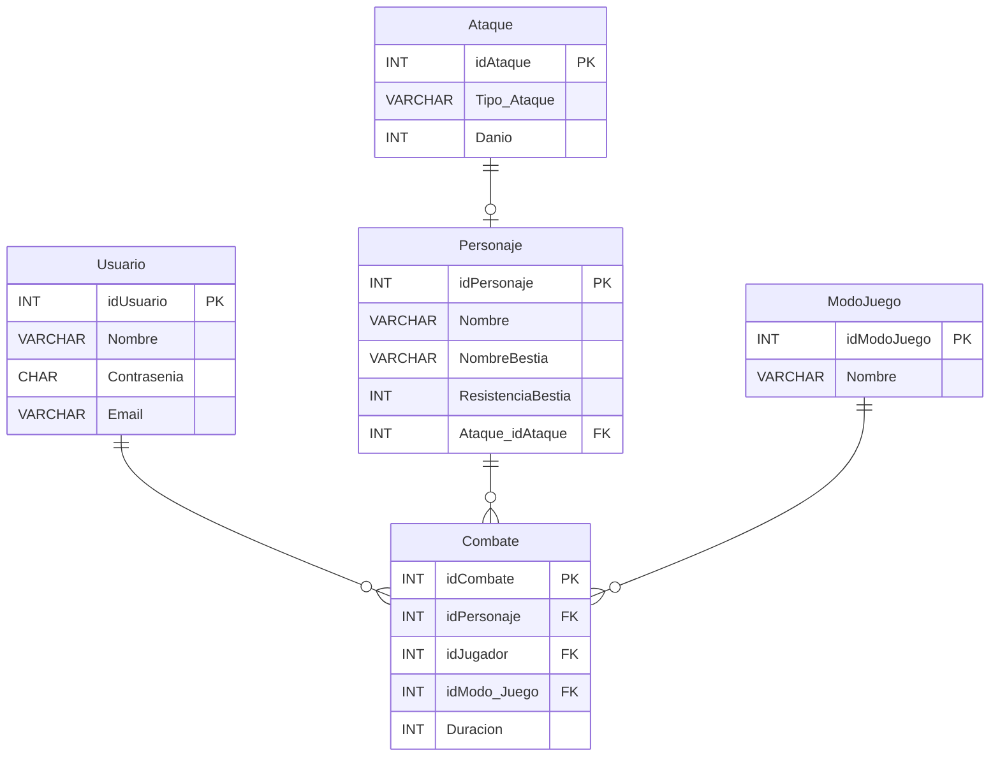

# Proyecto de Bloody Roar 2


## DER


## Sobre que trata el Proyecto
Esta base de datos maneja las interacciones y atributos esenciales de un juego basado en Bloody Roar 2, permitiendo una representación clara de los jugadores, personajes, ataques, modos de juego y combates. Con esta estructura, se puede almacenar y gestionar información sobre los jugadores, el desarrollo de los combates y las estrategias empleadas en el juego. Esta base de datos puede servir como un componente fundamental para desarrollar una aplicación de estadísticas o una plataforma de gestión de partidas, proporcionando datos útiles para los jugadores y administradores.


## Comenzando 

Clonar el repositorio github, desde Github Desktop o ejecutar en la terminal o CMD:

```
git clone https://github.com/giovanni-mendez/Base-Datos.git
```

## Requisitos 
- .NET 8.0 SDK
- MySQL 8 


## Integrantes del Proyecto:

* Diego Quintero
* Raul Cruz
* Giovanni Mendez
