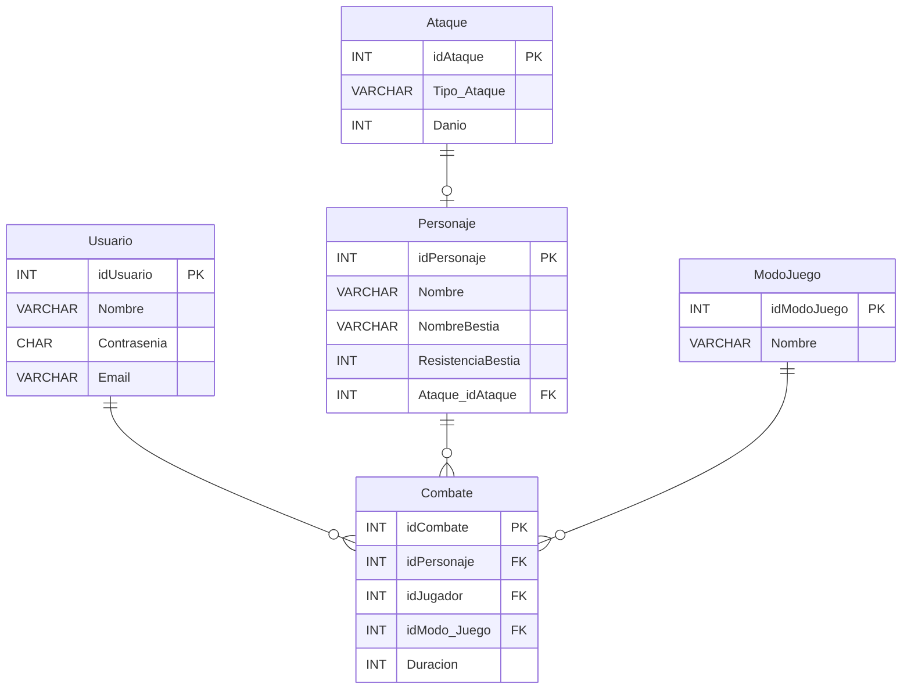

# Proyecto de Bloody Roar 2


## DER


## Sobre que trata el Proyecto
Esta base de datos maneja las interacciones y atributos esenciales de un juego basado en Bloody Roar 2, permitiendo una representación clara de los jugadores, personajes, ataques, modos de juego y combates. Con esta estructura, se puede almacenar y gestionar información sobre los jugadores, el desarrollo de los combates y las estrategias empleadas en el juego. Esta base de datos puede servir como un componente fundamental para desarrollar una aplicación de estadísticas o una plataforma de gestión de partidas, proporcionando datos útiles para los jugadores y administradores.


## Comenzando 

Clonar el repositorio github, desde Github Desktop o ejecutar en la terminal o CMD:

```
git clone https://github.com/giovanni-mendez/Base-Datos.git
```

## Requisitos 
- .NET 8.0 SDK
- MySQL 8

## Instrucciones para ejecutar los scripts SQL
Requisitos previos
Antes de comenzar, asegúrate de tener MySQL instalado y configurado en tu computadora. Para simplificar el proceso, te recomendamos agregar MySQL a las variables de entorno de tu sistema. Esto te permitirá ejecutar comandos de MySQL desde cualquier ubicación en la terminal.

## Pasos para ejecutar los scripts
Abrir la terminal en el directorio correcto: Dirígete al directorio donde están ubicados los archivos SQL usando la terminal.

Ingresar a MySQL: Ejecuta el siguiente comando para iniciar sesión en MySQL:

bash
Copiar código
```
mysql -u usuario -p
```
Reemplaza usuario por el nombre de usuario de tu base de datos.
Si estás en la computadora de la escuela, puedes usar el siguiente comando:
bash
Copiar código
```
mysql -u root -p
```
Se te pedirá la contraseña de tu usuario. En el entorno escolar, la contraseña por defecto suele ser root.
Ejecutar el script SQL: Una vez dentro del cliente de MySQL (verás algo como mysql> en la terminal), ingresa el siguiente comando para ejecutar el script:

sql
Copiar código
```
source install.sql;
```
Este comando cargará y ejecutará el archivo install.sql, que contiene las instrucciones para crear la base de datos, tablas y otros objetos.
Salir de MySQL: Cuando finalice la ejecución del script, puedes salir del cliente de MySQL escribiendo:

bash
Copiar código
exit
Ejemplo de ejecución
bash
Copiar código
```
$ mysql -u root -p
Enter password: ******
mysql> source Install.sql;
mysql> exit
```

## Integrantes del Proyecto:

* Diego Quintero
* Raul Cruz
* Giovanni Mendez
