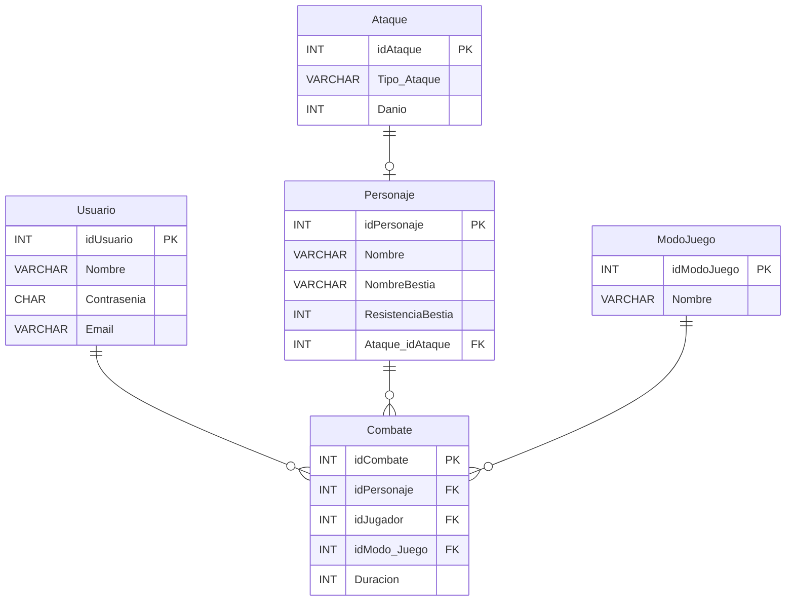

# Proyecto de Bloody Roar 2


## DER


## Comenzando 

Clonar el repositorio github, desde Github Desktop o ejecutar en la terminal o CMD:

```
git clone https://github.com/giovanni-mendez/Base-Datos.git
```

## Requisitos 
- .NET 8.0 SDK
- MySQL 8 


## Integrantes del Proyecto:

* Diego Quintero
* Raul Cruz
* Giovanni Mendez
